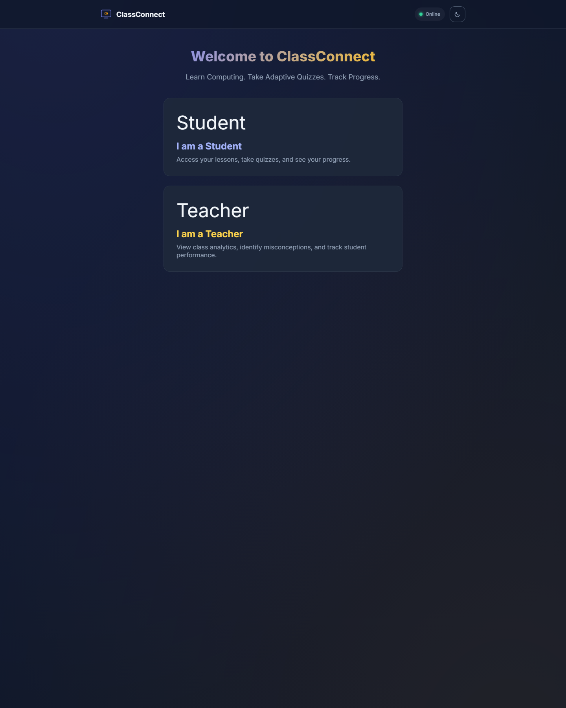
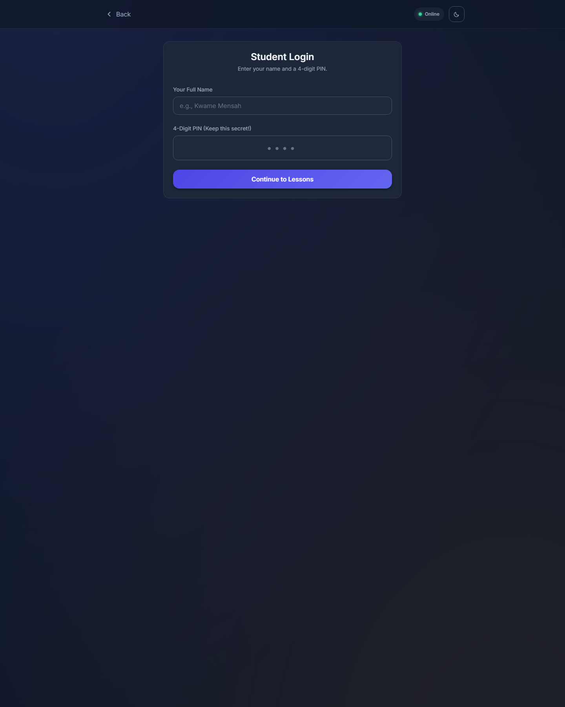
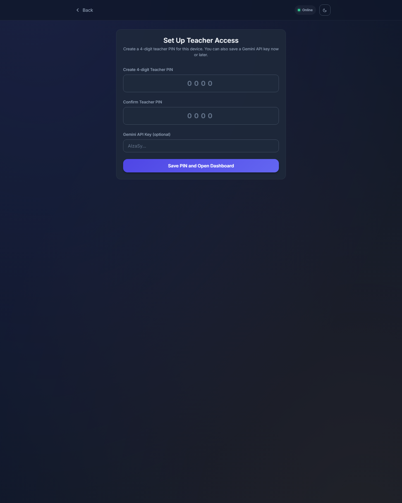

# ClassConnect

Offline-capable personalized learning and assessment for Basic 7 Computing in Ghana, with diagnostic assessment, adaptive lesson sequencing, AI tutoring, smart revision, adaptive quizzes, AI-powered assessments, and a device-local teacher dashboard.

## Screenshots

### Home


### Student Login


### Teacher Access


## Overview

ClassConnect is built for low-connectivity classrooms. Students can begin with a diagnostic assessment, follow a personalized lesson path, chat with an AI tutor, complete adaptive quizzes, take secure mixed-format assessments, and review explanations on the same device. Teachers use a PIN-protected dashboard to inspect progress, common misconceptions, diagnostic coverage, learner risk levels, and assessment quality data.

The project is aligned to the GES Common Core Programme strand **Introduction to Computer Systems** for **Basic 7 Computing**.

## Feature Map

This implementation now covers the core LMS personalization areas:

1. **Diagnostic assessment engine**
   A short adaptive readiness check identifies lesson-level knowledge gaps before learners begin the full sequence.
2. **Adaptive content path**
   Lesson recommendations update using diagnostic evidence, lesson completion, and quiz performance.
3. **AI tutor with memory**
   Students can ask follow-up questions in a context-aware tutor chat that remembers prior conversation on the same device.
4. **Adaptive assessment**
   The quiz engine uses a lightweight 3PL IRT model to estimate learner ability and choose the next most informative question.
5. **Learning analytics dashboard**
   Teachers get completion tracking, diagnostic coverage, risk prediction, misconception charts, intervention guidance, export, and student drill-downs.
6. **Advanced revision support**
   A smart revision queue prioritizes which lessons to revisit next based on gaps and recent missed questions.
7. **Zero-backend deployment**
   Student records, diagnostic history, tutor memory, quiz results, settings, and teacher access all live in IndexedDB and browser storage on the device.
8. **Live feedback cache + misconception memory**
   Wrong-answer explanations are generated live when possible, then saved locally so exact or common explanations can still be reused offline later.

## Assessment Platform

ClassConnect now also includes an AI-powered assessment workflow:

1. **AI question generator**
   Teachers can generate multiple-choice, short answer, and coding questions from selected lesson objectives.
2. **Intelligent grading**
   Open-ended responses are graded with rubric alignment using Gemini when available, with local fallback scoring when offline.
3. **Plagiarism / AI detection**
   Each submission gets a writing-style integrity review using lexical diversity, internal similarity, historical overlap, and a perplexity-style proxy.
4. **Browser-based proctoring**
   Secure assessment mode logs fullscreen exits, tab switches, blur events, shortcut attempts, and suspicious burst typing.
5. **Item analysis**
   Every assessment computes difficulty and discrimination values per item after submissions are collected.
6. **Advanced feature: auto remediation plan**
   Students receive targeted next-step remediation tasks based on the weakest assessed objectives.

## Curriculum Scope

The app includes five lessons:

1. What Is a Computer?
2. Inside the Computer
3. Input Devices
4. Output Devices
5. Storage and Putting It All Together

Each lesson includes:

- learning objectives
- rich reading content
- vocabulary support
- a lesson illustration
- completion tracking
- a linked adaptive quiz

## Architecture

```text
                     ClassConnect (Vite PWA)

 Home / Login / Diagnostic / Lessons / Tutor / Quiz / Dashboard / Assessment Lab
                |             |         |        |        |           |
                |             |         |        |        |           +--> Question generation + item analysis
                |             |         |        |        |
                |             |         |        |        +--> Chart.js analytics + risk insights
                |             |         |        |
                |             |         |        +--> Adaptive quiz engine (3PL IRT)
                |             |         |
                |             |         +--> AI tutor + memory + study guidance
                |             |
                |             +--> Knowledge-gap profile
                |
                +--> Assessment Center / Proctored Session / Results

                 IndexedDB + localStorage/sessionStorage
students | progress | diagnostics | tutorThreads | quizzes | assessments | assessmentSubmissions | settings | sessions

                     Service Worker (vite-plugin-pwa)
              precache shell/assets + runtime cache for lesson media

                     Online-only optional Gemini API
 quiz explanations | diagnostic coaching | tutor responses | question generation | grading
```

## Tech Stack

- **Frontend:** Vanilla JS with ES modules
- **Styling:** Vanilla CSS with design tokens and theme toggle
- **Build tool:** Vite 6
- **PWA:** `vite-plugin-pwa` + Workbox
- **Data persistence:** `idb`, `localStorage`, and `sessionStorage`
- **Charts:** Chart.js 4
- **AI features:** Google Gemini `gemini-2.0-flash`
- **Assets:** AI-generated lesson illustrations plus PWA icons

## Adaptive Quiz Design

ClassConnect uses a simplified **3-Parameter Logistic (3PL)** Item Response Theory model.

For each question, the engine stores:

- `difficulty` (`b`)
- `discrimination` (`a`)
- `guessing` (`c`)

During a quiz session the app:

1. starts the learner at `theta = 0`
2. selects the next question using maximum Fisher information
3. updates `theta` after each answer using iterative estimation
4. records time-per-question and theta trajectory
5. stops after 10 questions or once the estimate is stable enough

Saved quiz results include:

- final score
- final `theta`
- standard error
- total and average time
- per-question correctness
- per-question timing
- per-question theta movement
- full theta trajectory for analytics

## AI Feedback Strategy

When a student misses a question:

1. the app checks for a saved Gemini API key
2. the quiz view immediately sends the question, the student's answer, and the correct answer to Gemini for a warm 2-3 sentence explanation
3. successful responses are saved in IndexedDB for offline reuse on the same device
4. if the exact saved response is unavailable, the app can reuse a common saved explanation for that question as a misconception-memory fallback
5. if offline or the API fails and no saved match exists, it falls back to a local explanation from `src/data/fallback-hints.js`

This keeps feedback available even on unstable school networks.

## Personalization Layer

The new LMS layer adds four student-facing systems:

1. **Diagnostic assessment**
   The learner starts with a short adaptive pre-assessment that samples all five lessons and saves a readiness profile.
2. **Adaptive content path**
   The lessons page surfaces a recommended next lesson, a dynamic path preview, and a smart revision queue.
3. **AI tutor**
   A tutor chat uses the student's diagnostic, quiz history, and saved conversation thread to provide contextual support.
4. **Risk-aware analytics**
   The dashboard combines completion, diagnostic evidence, and quiz performance to predict which learners need help first.

## Assessment Workflow

Teacher flow:

1. Open **Assessment Lab** from the dashboard.
2. Select lesson coverage and question counts.
3. Generate and publish the assessment blueprint.
4. Review item analysis, flagged integrity cases, and proctor alerts after submissions come in.

Student flow:

1. Open **Assessment Center** from the learning hub.
2. Start a secure assessment session.
3. Submit answers for rubric grading and integrity review.
4. Review feedback, proctor summary, and the auto remediation plan.

## Teacher Workflow

Teacher access is protected with a 4-digit PIN on each device.

On first use:

1. open **Teacher**
2. create a 4-digit teacher PIN
3. optionally save a Gemini API key
4. enter the dashboard

The dashboard currently supports:

- total students
- average latest score
- lesson completion rate
- students at risk using a risk score
- diagnostic coverage
- average score by lesson
- ability distribution
- horizontal misconception chart
- intervention queue
- class mastery snapshot
- published assessment count
- lessons completed in the roster
- CSV export
- per-student drill-down with quiz history, theta trajectory, readiness, risk, and per-question performance

## Offline Support

The project is designed to remain useful after first load.

What works offline:

- diagnostic assessments
- lesson reading
- stored screenshots and illustrations
- lesson completion tracking
- adaptive quizzes
- local assessment generation fallback
- rubric-based fallback grading
- AI tutor fallback responses
- saved AI quiz feedback explanations and common question-level reuse
- local results review
- dashboard analytics, including charts, from the local bundled chart library
- dashboard analytics for the data already on the device

What needs connectivity:

- first-time asset download
- Gemini explanation, tutor, coaching, question generation, and grading requests

Workbox configuration now includes:

- static asset precache
- SPA app-shell navigation fallback to `index.html`
- lesson image cache
- app-shell runtime cache for local scripts, styles, fonts, and workers
- Google Fonts cache
- Gemini runtime strategy configuration

## Setup

```bash
npm install
npm run dev
```

Build for production:

```bash
npm run build
```

Preview the production build:

```bash
npm run preview
```

## Project Structure

```text
src/
  components/
    nav.js
    progress-bar.js
    question-card.js
    feedback-card.js
    stat-card.js
    ui.js
  data/
    lessons.js
    quiz-bank.js
    fallback-hints.js
  engine/
    adaptive-quiz.js
    ai-feedback.js
    ai-tutor.js
    assessment-generator.js
    assessment-grading.js
    diagnostic.js
    item-analysis.js
    personalization.js
    proctoring.js
    storage.js
    submission-analysis.js
    theme.js
  views/
    assessment-center.js
    assessment-lab.js
    assessment-results.js
    assessment-session.js
    diagnostic.js
    diagnostic-results.js
    home.js
    student-login.js
    teacher-login.js
    lesson-viewer.js
    quiz.js
    quiz-results.js
    tutor.js
    dashboard.js
  styles/
    assessment.css
    personalization.css
```

## Deployment Guide

### Vercel

1. Import the repository into Vercel.
2. Keep the default Vite build command: `npm run build`.
3. Keep the output directory as `dist`.
4. Deploy over HTTPS so service workers can register correctly.

### GitHub Pages

1. Build the app with `npm run build`.
2. Publish the `dist` directory through your preferred Pages workflow.
3. If deploying under a subpath, update Vite base settings and PWA paths accordingly.

## Known Limitations

- Data is intentionally device-local. There is no backend sync yet.
- Teacher authentication is device-scoped, not centrally managed.
- Gemini explanations depend on a client-side API key and internet access.
- The proctoring system is browser-based and cannot enforce full operating-system lockdown.
- AI-detection is heuristic and should be treated as a review signal, not a final verdict.
- The screenshot set currently focuses on entry flows; richer dashboard captures can be added later from a seeded demo dataset.

## License

MIT
